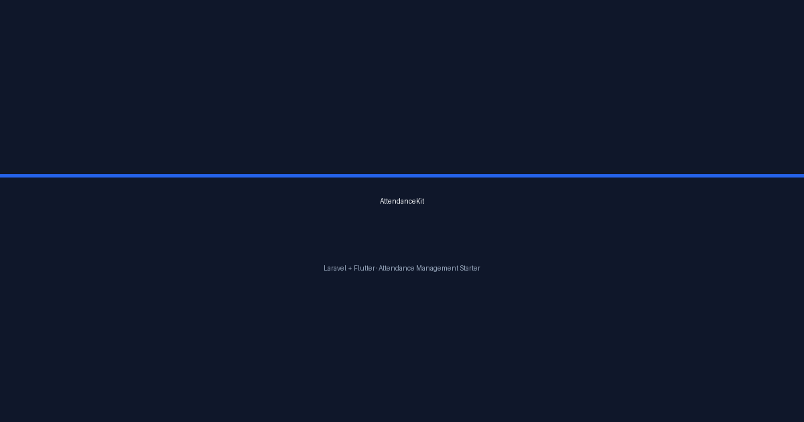
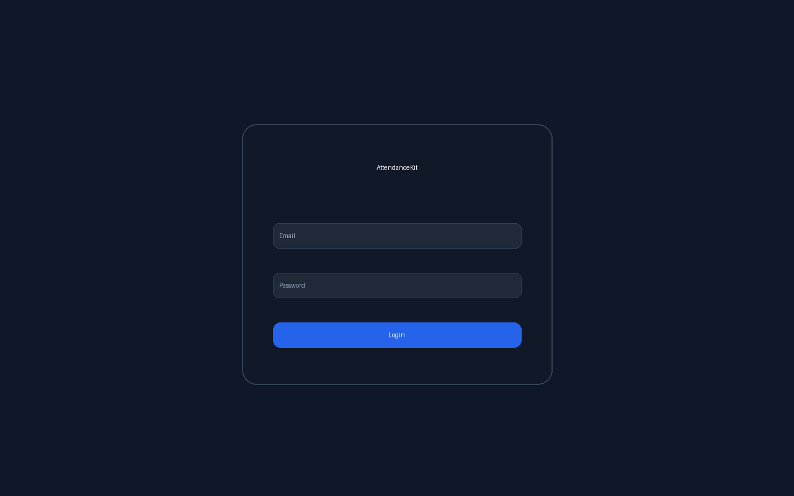
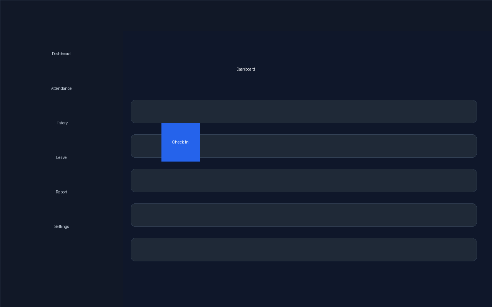
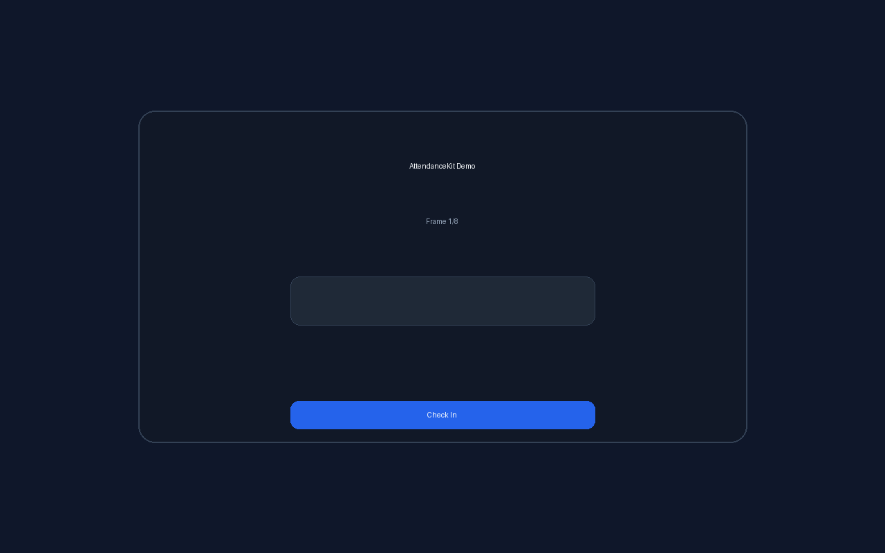

# AttendanceKit

> Generic open-source attendance management starter kit. Clean, modular, and ready for production.

 

## Features

### Mobile
- Login
- Dashboard
- Check In
- Check Out
- Daily Report
- Attendance History
- Leave Request
- Calendar
- Notifications
- Profile
- Settings

### Attendance Features
- GPS Location
- Camera Verification
- Photo Upload
- Offline Queue
- API Synchronization

## Screenshots

| Screenshot | Preview |
|------------|---------|
|  |  |

## Installation

See [docs/installation.md](docs/installation.md) and [docs/deployment.md](docs/deployment.md).

## API

See [docs/api.md](docs/api.md), [docs/openapi.yaml](docs/openapi.yaml), and [postman/attendance-kit.postman_collection.json](postman/attendance-kit.postman_collection.json).

## Structure

See [docs/folder-structure.md](docs/folder-structure.md) and [docs/architecture.md](docs/architecture.md).

## Roadmap

See [docs/roadmap.md](docs/roadmap.md).

## Releases

See [Releases](https://github.com/pujosety/AttendanceKit-Open-Source-Attendance-Management-Starter/releases).

## Documentation

See [/docs](/docs).

## License

MIT
